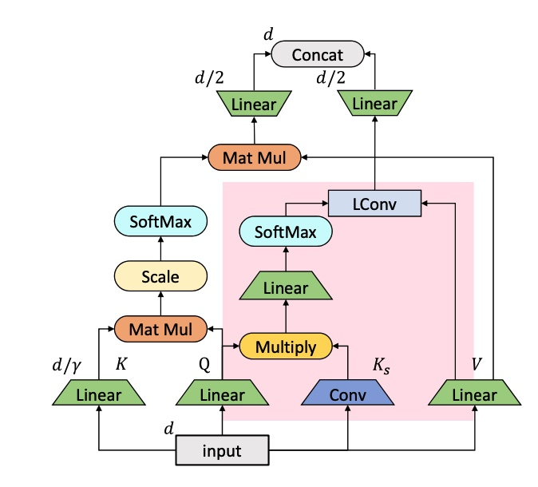

# ConvBert-PyTorch
🤗A unofficial PyTorch implementation of ConvBert based on huggingface/transformers.

🤗基于huggingface/transformers的ConvBert的非官方PyTorch实现。

## requirements
1. transformers==3.5.1
2. torch>=1.5.0

## Reference
1. [ConvBERT: Improving BERT with Span-based Dynamic Convolution](https://arxiv.org/abs/2008.02496)
2. [yitu-opensource/ConvBert](https://github.com/yitu-opensource/ConvBert)
3. [huggingface/transformers](https://github.com/huggingface/transformers)
4. [JunnYu/ConvBert_huggingface](https://github.com/JunnYu/ConvBert_huggingface)
